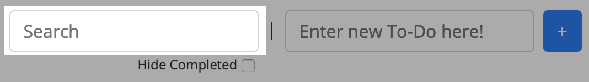

# Neu To-Do's
>A simple browser-base To-Do app

## How to use
- Enter your to-do into the text field "Enter your To-Do here!"

- Either press "Enter" or click "+" to add the To-Do to the list.

- You can use the "Search" field to filter To-Do's. As you type the To-Do list will be updated.

- You can mark To-Do's as completed.

- You can remove To-Do's as well.

## About
Neu To-Do's uses local storage to store data. This data is local on your machine within your browser. This tool
does not track, or use said data anywhere outside of populating and manipulating your To-Do list.

This project was built with HTML5, CSS3/Bootstrap, JavaScript and uses <a href="https://github.com/uuidjs/uuid">UUID</a>
to generate unique IDs.
